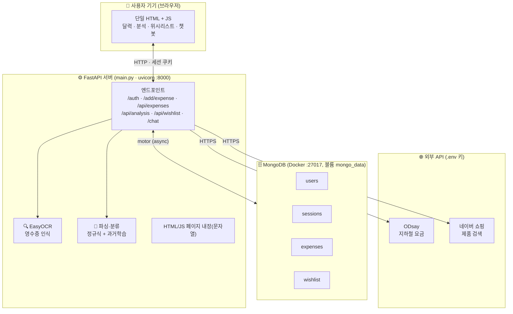
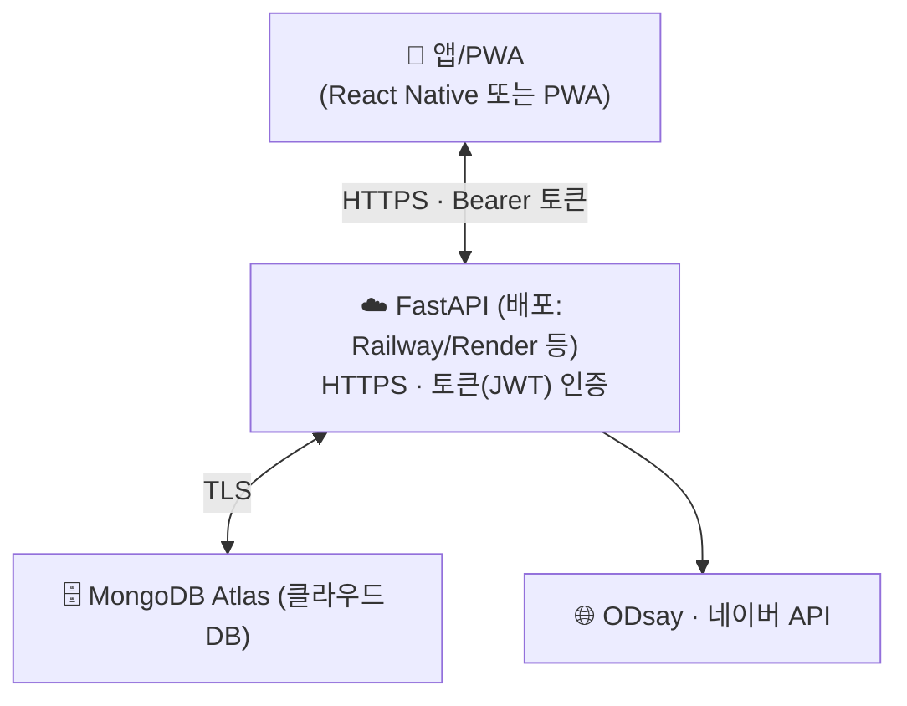

# Receiptly 아키텍처

> 이미지 버전: [architecture.svg](architecture.svg) (브라우저로 열면 그림으로 보여요)

## 현재 (로컬)

**핵심**: UI·API·OCR이 전부 한 FastAPI 프로세스(`main.py`)에 있고, DB는 로컬 Docker MongoDB. 외부 API 키는 서버의 `.env`에만 있음(브라우저 미노출). **전부 localhost라 이 컴퓨터에서만 접근 가능**, 데이터는 Docker 볼륨에 저장.

## 앱/배포로 가려면 (목표 아키텍처)

**바뀌는 점**: ① DB를 Atlas(클라우드)로, ② 백엔드를 공개 서버에 배포(HTTPS), ③ 네이티브 앱이면 쿠키 대신 토큰 인증, ④ 배포 전 보안(비밀번호 bcrypt·XSS·세션 만료) 정리. UI를 API에서 분리(현재 `/api/*`가 이미 있어 기반은 있음).
